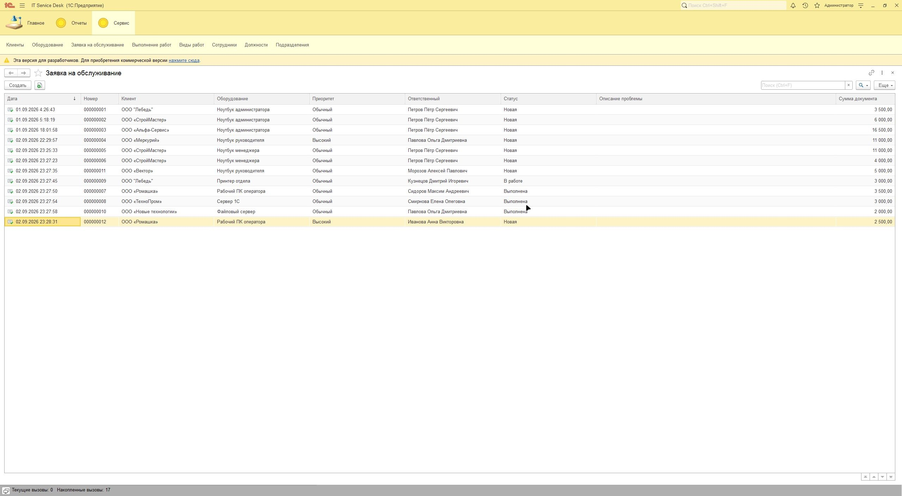
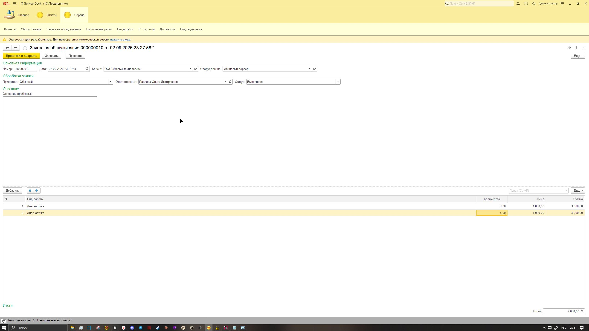
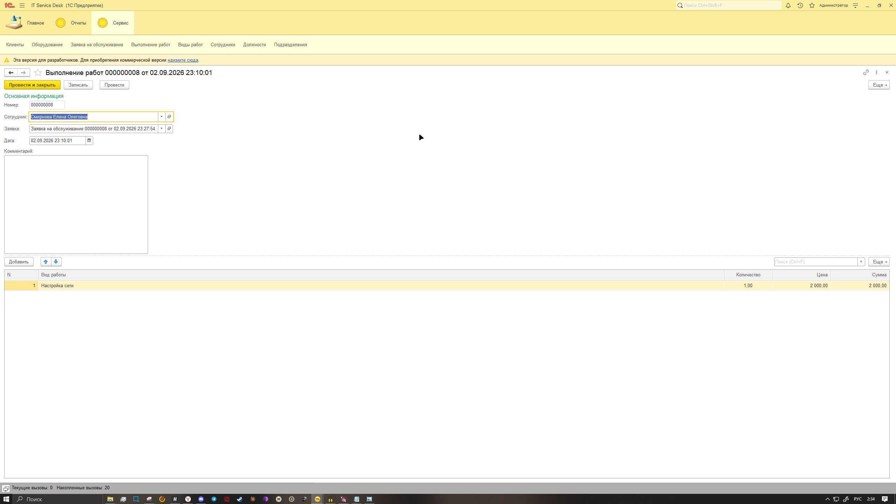
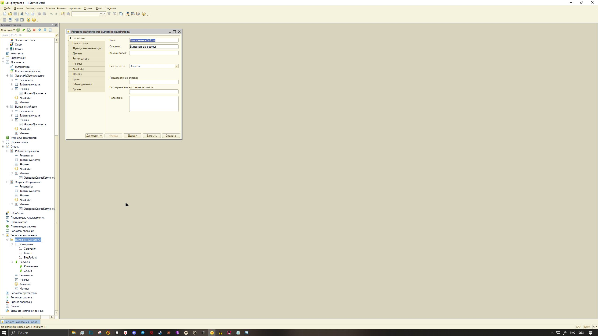
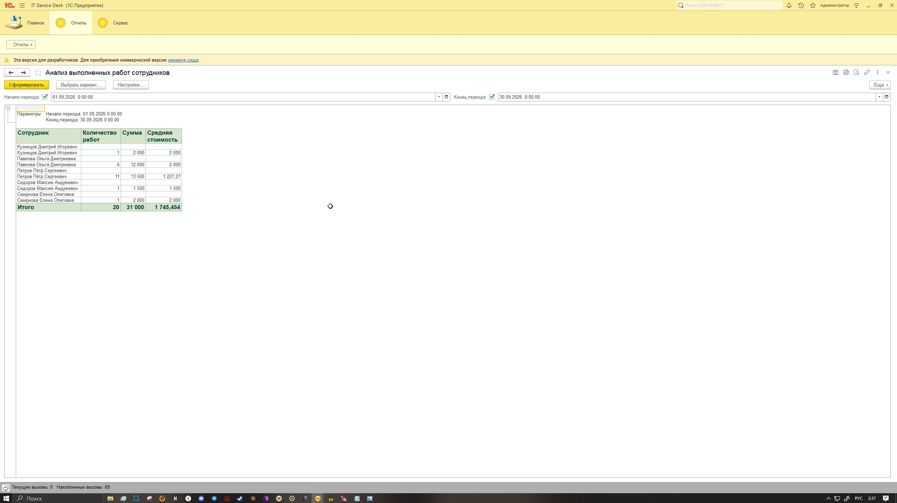
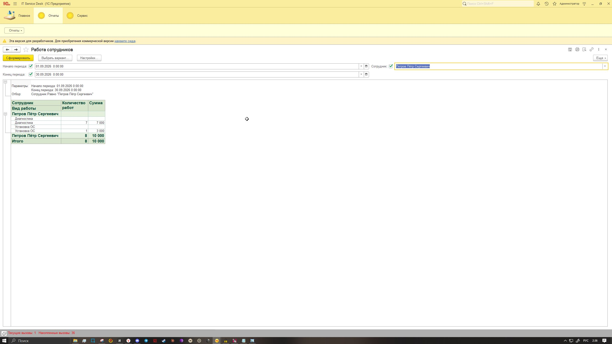
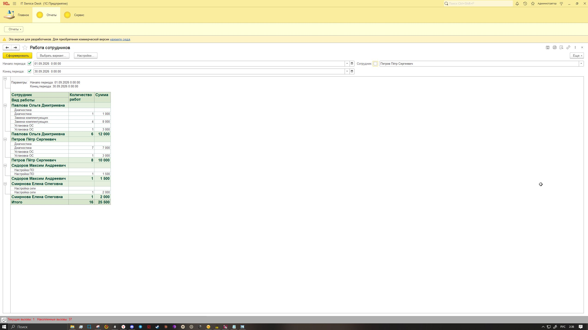
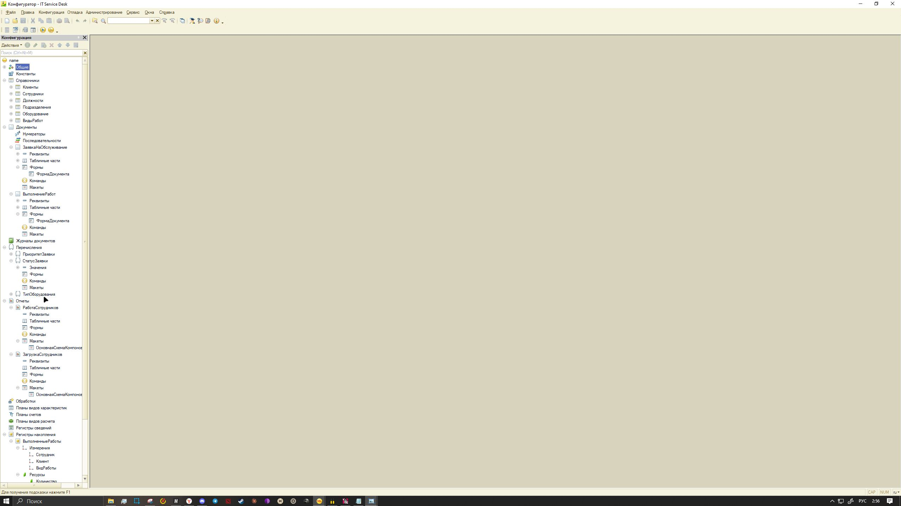
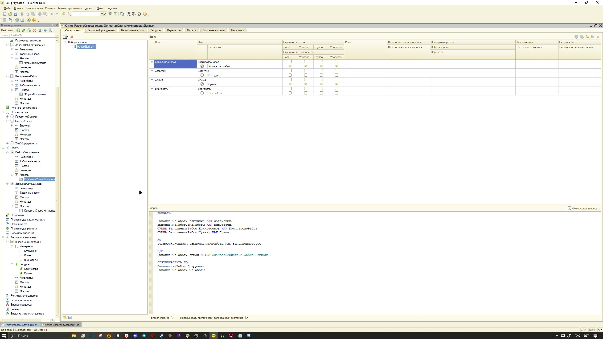

# ServiceCenter_1C

## Информационная система автоматизации сервисного центра

Pet-проект на платформе **1С:Предприятие 8.3**, предназначенный для автоматизации процессов сервисной организации: учета клиентов, оборудования, заявок на обслуживание и выполнения работ сотрудниками.

В рамках проекта реализована модель реального прикладного решения с использованием объектов конфигурации 1С, механизмов проведения документов, регистров накопления, системы компоновки данных и разграничения прав доступа.

---

# Основной функционал

## Учет клиентов и оборудования

Реализованы справочники:

- Клиенты;
- Оборудование;
- Сотрудники;
- Виды работ;
- Должности;
- Подразделения.

Система позволяет хранить информацию о заказчиках, обслуживаемом оборудовании и сотрудниках сервисного центра.

---

## Управление заявками на обслуживание

Реализован полный цикл работы с заявками:

- создание заявки от клиента;
- указание оборудования и описания проблемы;
- назначение ответственного сотрудника;
- изменение статуса выполнения.

Логика процесса построена с учетом реального сценария работы сервисной организации.

---

## Выполнение работ и проведение документов

Разработан документ **"Выполнение работ"**, который используется для фиксации оказанных услуг.

Реализована обработка проведения документа:

- проверка обязательного заполнения данных;
- контроль корректности введенных значений;
- формирование движений по регистру накопления;
- автоматическое изменение статуса заявки после выполнения работ.

При проведении документа система записывает информацию о выполненных работах:

- сотрудник;
- клиент;
- вид работы;
- количество;
- сумма.

---

# Архитектура решения

Конфигурация построена на основе стандартной объектной модели 1С:

### Справочники

Используются для хранения нормативно-справочной информации:

- сотрудники;
- клиенты;
- оборудование;
- виды работ.

### Документы

Используются для регистрации хозяйственных операций:

- заявка на обслуживание;
- выполнение работ.

### Регистры накопления

Создан регистр:

**ВыполненныеРаботы**

Предназначен для хранения истории выполненных услуг и дальнейшего анализа данных.

Измерения:

- Сотрудник;
- Клиент;
- ВидРаботы.

Ресурсы:

- Количество;
- Сумма.

---

# Отчетность

Разработаны отчеты на базе **Системы компоновки данных (СКД)**.

Реализованы возможности:

- группировка данных;
- отборы по периоду;
- вывод итоговых значений;
- анализ выполненных работ сотрудников.

---

# Разграничение прав доступа

Настроена ролевая модель пользователей:

- **Администратор системы** — настройка и полный доступ к объектам конфигурации;
- **Мастер** — работа с заявками и выполнением работ;
- **Полные права** — полный доступ к конфигурации.

Настроены роли и права доступа к объектам метаданных.

---

# Используемые технологии

- 1С:Предприятие 8.3
- Управляемое приложение
- Конфигуратор 1С
- Встроенный язык 1С
- Язык запросов 1С
- Система компоновки данных (СКД)
- Документы и проведение
- Регистры накопления
- Роли и права доступа
- Git / GitHub

---

# Результат проекта

В результате разработана конфигурация, моделирующая работу сервисного центра и демонстрирующая навыки разработки прикладных решений на платформе 1С:Предприятие 8.3.

Проект отражает практическое применение механизмов платформы:
объекты метаданных, программная логика, проведение документов, регистры, отчеты и управление доступом.

## Скриншоты работы системы

### Главное меню и структура подсистем

### Заявка на обслуживание

Реализован процесс создания и обработки заявок:
- выбор клиента и оборудования;
- назначение ответственного сотрудника;
- установка приоритета и статуса;
- расчет стоимости выполненных работ.

### Выполнение работ

Документ используется для фиксации выполненных работ сотрудниками.
При проведении формируются движения в регистре накопления "ВыполненныеРаботы".

### Регистры накопления

Реализован учет выполненных работ с хранением:
- сотрудника;
- клиента;
- вида работы;
- количества;
- суммы.

### Отчеты

Добавлены отчеты на СКД:
- анализ выполненных работ;
- загрузка сотрудников;
- количество выполненных работ;
- суммы оказанных услуг.

## Скриншоты разработки

### Структура конфигурации

### Схема отчета СКД

